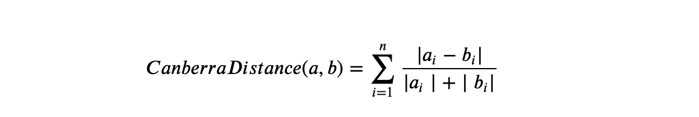
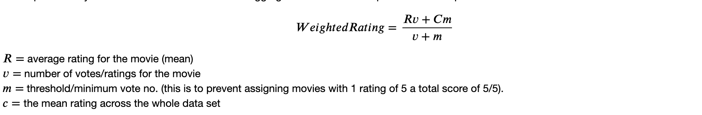
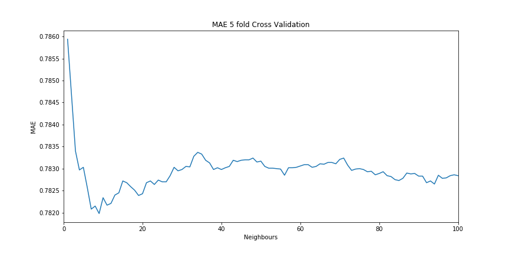
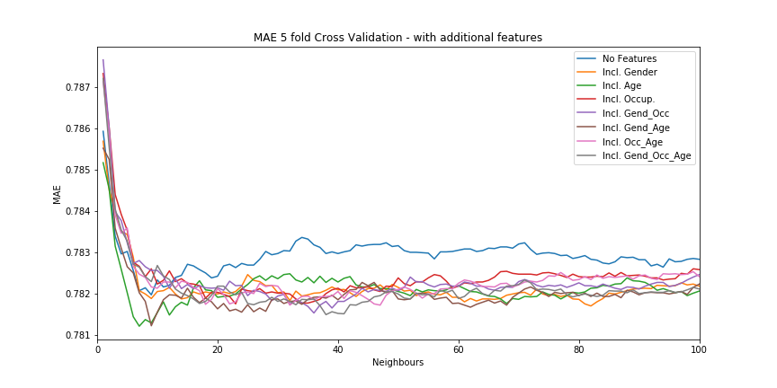

# Movie recommendations

## K-NN & Choosing the appropriate distance metric:
The method used to construct the movie recommendation system is the K-Nearest Neighbours (K-NN) classification algorithm, which essentially looks to make predictions based on closest data points. 

The algorithm works by calculating the distance between each data point and by doing so determining the nearest neighbour(s) for each point. There are many distance measurers used in calculating the distance, some of the most common include: Euclidean, Manhattan, Minkowski, Hamming and Cosine distances as, with several others, were studied by Chomboon et al (2015).

In the code for this task, the scikit-learn library’s functions, `NearestNeighbors()` and `.kneighbours()`, are used to fit the training data and compute the neighbours and distance matrix. According to scikit-learn.org (2019) `sklearn.neighbors.DistanceMetric` the distance metrics intended for ‘integer-valued’ and  ‘real-valued vector spaces’ are the Hamming, Cranberra and BrayCurtis distances. Given that the data we are working with, movie ratings, has an integer-value space of 1-5 (and 0 where there are no ratings), it is most appropriate to implement one of the aforementioned distance metrics. After having tested all three distance metrics when fitting the nearest neighbours we find that when using the Cranberra distance metric (and with k = 9)  we achieve the lowest Mean Absolute Error (MAE) of 0.78198 (this score and neighbour value will be further discussed and explained in the ‘Accuracy Testing’ section of the ‘Code Narration’ part of this report).

The Canberra distance between vectors a and b, as stated by Surya, V. B et al (2019), is a weighted version of the Manhattan distance and is calculated as follows:

It is the absolute difference of the values of vector a and b divided by the individual absolutes of the values of vector a and b summed.

## Code Narration

### Data wrangling, train-test split and cross validation
We begin by reading/parsing all the pre-split train-test split csv(s) (u1.base and u1.test to u5.base and u5.test) by using pandas.read_csv. The train and test data-frames are then labelled  ‘u_train1 to u_train5’ and ‘u_test1 to u_test5’ respectively. 

For the cross-validation, we create the two lists ‘trains’ and ‘tests’ which contain the 5 different train data sets (‘trains = [u_train1, u_train2, u_train3, u_train4, u_train5]’) and the 5 different test data sets (‘tests = [u_test1, u_test2, u_test3, u_test4, u_test5]’) respectively. With these lists we are able to create an inner loop (the cross-validation loop inside the neighbours loop – this will be further explained in the Accuracy testing section) which loops ‘i’ through the range of the length of one of the lists (len(trains) = 5). By doing so we are able to run the entire fitting and accuracy testing code on each train test split by indexing trains[i] and tests[i] while storing the 5 MAE scores in a list. Once the loop has gone through all 5 folds of the cross validation, we calculate the average of the 5 MAE scores to get the final score.

With regards to wrangling the data, with both the train and test, we begin by creating a train and test pivot dataframe, via ‘train = trains[i].pivot(*trains[i].columns[:-1])’, in which we have the user_id in numerical order on the y-axis (rows) and the movie_id in numerical order on the x-axis (columns). Given that the train data doesn’t always contain every movie_id we store the columns of the dataframe under the variable ‘re_index = train.columns’ so that we can later re_index the ratings after having carried out calculations using matrices. We then fill all the nan values with 0 and convert the dataframe to a numpy matrix. The rows of the matrix (+1) represent a user id i.e. row 0 will represent user id 1 and row 23 will represent user id 24. The columns of the matrix when used as an indexer in the re_index vector will yield the correct/corresponding movie id, i.e. re_index[matrix column] = movie id.

### Pre-processing and K-NN fitting
Using the weighted movie rating formula, 

inspired by the IMDB rating formula stated on help.imdb.com (2019). The arbitrary threshold,  'm',   is assigned to be the Q1, 1st quartile, of votes. This rating formula breaks down movie ratings into two components, the movie’s average rating and the average rating over the whole dataset, these components are then weighted by the ratio of votes over the sum of votes and the threshold value, and the ratio of the threshold over the sum of threshold value and votes respectively. Therefore ratings with fewer votes are penalized and ratings will skew towards the average over the whole data set. This defends against rating movies with 1 vote of 5stars to a movie rating of 5.

With these ratings we fill a copy of the ‘train_’ matrix where movies have a 0 rating, i.e. are non-rated. This is done to protect against the fitting process assuming a zero-distance component in instances where both users haven’t seen or rated the same movie whilst also protecting against a greater difference component when a user hasn’t seen a movie and the neighbour has.

With the filled movie rating matrix we fit the training data using `NearestNeighbors(K, metric = ‘canberra’)`. By doing so we are then able to produce a neighbour matrix and a distance matrix (both of the shape (943, K)) by using `user, dist = n.kneighbors()`. With this we are then able to calculate a weightings matrix (shape (943, K)) which is calculated by: $\frac{\frac{1}/{distance_{i}}}{\frac{1}{\sum \limit{i=1}^{K} distances}}$. Additional to this by creating a 3-dimensional matrix of the filled movie rating matrix and the neighbours matrix we are able to carry out a `numpy.einsum` multiplication producing a predicted ratings matrix, called `recommendations`, i.e. a matrix full of ratings in which we predict the user would rate a movie based on its neighbours:

`recommendations = np.einsum('ukr, uk -> ur', three_d, weighting)`

Then by excluding already seen/rated movies for a given user as well as using `np.argsort(recommendations)[user_id-1][::-1]` we are able to receive the index numbers with which we can then index the re_index vector to get the correct order of movie id suggestions. For example using u1.base as training data and user_id 500, we get the following top 5 movie recommendations in order:
`["Schindler's List (1993)", 'Close Shave, A (1995)', 'Shawshank Redemption, The (1994)',  'Wrong Trousers, The (1993)', 'Casablanca (1942)']`

### Accuracy Testing and finding the optimal K value (no. of neighbours)

For accuracy testing we calculate the differences between the actual ratings assigned from a given user to a given movie in the test data and the prediction created, rounded to the nearest 1 decimal place, in the ‘recommendations’ matrix. To do so we create the pandas dataframe ‘predictions’ and loop through the test data to retrieve a movie id and user. We then append the predicted rating for that given user and movied to an empty list ‘p’. In the event that a movie exists in the test data and not the train we assign an arbitrary naïve prediction of 3 and append it to the list. This is done by using a try and except statement where if the movie id retrieved from the test cannot be found in the train, we assign the rating to be 3 via the except statement. The errors are calculated by taking absolute difference of the predicted and the test ratings, the mean absolute error is then calculated and appended to an empty list for the given fold of the cross validation. Once the loop has run through all 5 folds, we calculate the mean of the 5 MAE scores.

Finally, in order to find the optimal k value/number of neighbours such that to minimize the MAE, as briefly mentioned in the ‘Data wrangling, train-test split and cross validation’ section, we create an outer loop in which we loop through values of K within a range of 1 to 100. Within this range and for each value of K the entire code explained above will run, i.e. the data wrangling, pre-processing, K-NN fitting and accuracy testing, for each fold of cross validation, the MAEs for each K value are stored in a numpy array, then by using `numpy.argmin + 1` we are able to retrieve the k value which minimizes the MAE. The minimizing k value was found to be K = 9 which resulted in a MAE = 0.78198.

Note that up until K = 9 we see great changes/improvements in the accuracy of the model this is because below K = 9 the model is not including certain neighbours which are also strongly correlated and provide additional ratings. However for values 9 < K < 38 we see a trend of MAE increasing with the value of K, this is due to the addition of more neighbours diluting the correlations as the nearest neighbours are more strongly correlated with the target user, whilst less near neighbours are less correlated. After K=38 we then see a random walk like behaviour in the MAE. 

### Inclusion of other features
Finally, we also test the model with the inclusion of more user features. The gender and occupation feature are converted to a gender dummy vector and the occupation feature converted to 21 occupation dummy vectors, whilst the age feature is left as is. We run the code on all different possible combinations of the 3 chosen features as well as including them individually. The inclusion of solely the age feature improves the accuracy the most (K = 7, MAE = 0.78122), and the combination of gender and age makes the second largest accuracy improvement (K = 9, 0.7812300000000001). Inclusion of all features improve accuracy of the model with K > 15.

## Bibliography:
Chomboon, K., Pasapichi, C., Pongsakorn, T., Kerdprasop, K., Kerdprasop, N. (2015), An empirical study of distance metrics for k-nearest neighbor algorithm, In The 3rd International Conference on Industrial Application Engineering 2015.

IMDB Help Centre, (2019), How do you calculate the rank of movies and TV shows on the Top Rated Movies and Top Rated TV Show lists?,[Online]. Available from: https://help.imdb.com/article/imdb/track-movies-tv/ratings-faq/G67Y87TFYYP6TWAV# [Accessed: 01/12/2019].

scikit-learn.org, (2019), sklearn.neighbors.DistanceMetric,[Online]. Available from: https://scikit-learn.org/stable/modules/generated/sklearn.neighbors.DistanceMetric.html?fbclid=IwAR1ici7dQzEhsu2qK-zv-RXAigY2zGm51678j0Mv477EbL0bstbORy7bkCw [Accessed: 07/12/2019].

Surya, V. B., Alfeilat, H. A. A., Hassanat, A. B. A., Lasassmeh, O., Tarawneh, A. S., Alhasanat, M. B., Salmane, H. S. E., (2019). Effects of Distance Measure Choice on KNN Classifier Performance - A Review, Big Data 10.1089/big.2018.0175.
